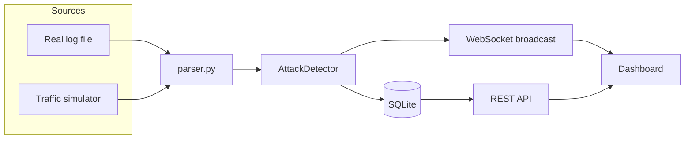

# LogSentinel

**A self-contained Apache log analyzer & attack detector that runs entirely on your machine — no cloud account, no external database, nothing to host.**

[](https://github.com/Rohit30Confluence/logsentinel/actions/workflows/ci.yml)
[](LICENSE)
[](backend/requirements.txt)

Point it at a real Apache access log, or hit "Start live simulation" and
watch it catch brute-force logins, SQL injection, XSS, and path traversal
attempts in synthetic traffic in real time — all in a terminal-styled
dashboard, all stored in a local SQLite file.

---

## Why this exists

Most "log analyzer" side projects either (a) never actually run — see
[`RESEARCH.md`](RESEARCH.md) for a breakdown of a broken predecessor to this
project that shipped a syntax error in its core parser and couldn't execute
a single one of its three documented entry points — or (b) require you to
stand up Redis, Postgres, and a cloud account just to see a demo. LogSentinel
is the opposite bet:

- **It actually runs.** Every code path here — CLI, API, WebSocket,
  simulator — is covered by a test that's part of CI, and the CLI is
  re-executed against the sample log on every single CI run as a smoke test.
- **It needs nothing external.** SQLite instead of Postgres/Redis. A
  dependency-free vanilla JS dashboard instead of a Node build pipeline.
  Synthetic traffic generation instead of requiring you to already have
  production logs. `pip install` and you're done.
- **One detection engine, not two.** Every entry point calls the exact same
  `AttackDetector` — there's no CLI/API implementation drift to accidentally
  fix in one place and not the other.

## Features

- **Log parsing** — Apache Common/Combined Log Format, streamed line-by-line.
- **Signature-based detection**: brute force (repeated 401/403 from one IP),
  SQL injection, XSS, and path traversal / LFI — all percent-decoded before
  matching so `%2e%2e%2f`-style encoding doesn't slip through.
- **Real anomaly detection** — each IP's traffic is compared against *its own
  recent history* stored in SQLite, not just against other IPs in the same
  batch. That's a real (if simple) time-series baseline.
- **Live dashboard** — WebSocket-pushed alert feed, per-type breakdown, top
  attacking IPs, all in a dependency-free single-page UI.
- **Traffic simulator** — generates realistic benign + malicious traffic on a
  timer, run through the exact same detection pipeline as everything else, so
  you have something to watch without needing real logs.
- **One-shot CLI** — analyze a static log file without running the server.
- **Fully tested** — 20 pytest tests across parsing, every detector
  (including negative/false-positive tests), and full API integration.

## Screenshot

*(Add a screenshot or short screen recording of the dashboard here after your
first run — `Start live simulation` and give it ~15 seconds to populate.)*

## Architecture



One parser, one detector, one database. The CLI and the API both import the
same `app.detector.AttackDetector` — there's no second implementation to
drift out of sync.

## Quickstart (no Docker)

```bash
git clone https://github.com/<you>/logsentinel.git
cd logsentinel/backend
python -m venv .venv && source .venv/bin/activate
pip install -r requirements.txt

# one-shot analysis of a log file
python cli.py --input ../data/sample_access.log

# or run the live server + dashboard
uvicorn app.main:app --reload
# open http://localhost:8000 and click "Start live simulation"
```

## Quickstart (Docker)

```bash
docker compose up --build
# open http://localhost:8000
```

This runs a single local container — SQLite is a file inside a Docker
volume, there's no separate database service and nothing leaves your
machine.

## Project structure

```
.
├── backend/
│   ├── app/
│   │   ├── parser.py            # Apache combined log -> structured dict
│   │   ├── detector.py          # AttackDetector facade (the ONE detection path)
│   │   ├── db.py                # SQLite persistence + anomaly history
│   │   ├── simulator.py         # synthetic traffic generator
│   │   ├── main.py              # FastAPI app: REST + WebSocket + static UI
│   │   └── detectors/
│   │       ├── brute_force.py
│   │       ├── sql_injection.py
│   │       ├── xss.py
│   │       └── path_traversal.py
│   ├── static/                  # dashboard: plain HTML/CSS/JS, zero build step
│   ├── cli.py                   # one-shot CLI, no server required
│   ├── tests/                   # 20 tests: parser, each detector, full API
│   └── requirements.txt
├── data/sample_access.log       # one instance of each attack type, for demos
├── docker-compose.yml
└── .github/workflows/ci.yml     # tests run on every push, 3 Python versions
```

## Testing

```bash
cd backend
python -m pytest tests/ -v
```

20 tests: log parsing (valid/malformed/edge cases), every detector with both
a positive case and a "clean traffic produces no alerts" negative case, and
full API integration tests hitting `/api/analyze`, `/api/alerts`,
`/api/stats`, and the simulator start/stop endpoints.

## Known limitations

Documented honestly, same as its predecessor:

- **Signature/threshold-based, not ML.** It won't catch attacks split across
  unusual encoding layers, heavily obfuscated payloads, or slow/low brute
  force spread across many IPs (no cross-IP correlation).
- **Anomaly detection baselines per-IP over a modest window** (last 20
  observation windows) — it's a real history, not a single-batch heuristic
  like a lot of toy projects ship, but it's still simple z-scoring, not a
  seasonal or ML model.
- **No auth on the API by default** — this is designed to run on localhost
  for personal/demo use. If you expose it beyond that, put an API key or
  reverse-proxy auth in front of it first.
- **SQLite, not built for concurrent high-volume ingestion.** Fine for a
  personal box or a demo; if you need to ingest real production traffic at
  volume, swap `db.py`'s engine URL for Postgres (SQLAlchemy makes this a
  small change) and add a queue in front of the detector.

## Roadmap / ideas for contributors

See [CONTRIBUTING.md](CONTRIBUTING.md). Rough ideas: nginx log format
support, additional detectors (command injection, scanner user-agent
fingerprints), CSV/JSON export from the dashboard, a "replay a real log file
at simulated real-time speed" mode.

## License

MIT — see [LICENSE](LICENSE).
